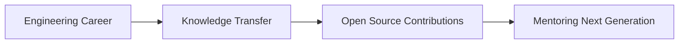

#  WindTunnelRetirement

<div align="center">
  
```ascii
    ╔══════════════════════════════════════════════════════════╗
    ║                    🌬️ WIND TUNNEL LAB 🌬️                  ║
    ║                                                          ║
    ║  ┌─────┐    ┌──────────┐    ┌─────────────┐    ┌──────┐ ║
    ║  │ >>> │────│ ANALYSIS │────│ OPTIMIZATION │────│ >>> │ ║
    ║  └─────┘    └──────────┘    └─────────────┘    └──────┘ ║
    ║                                                          ║
    ║    Transitioning from Aerodynamics to Code Dynamics     ║
    ╚══════════════════════════════════════════════════════════╝
```

</div>

---

## 🎯 **Current Focus**

<table>
<tr>
<td width="50%">

### 🌀 **From Wind Tunnels to Workflows**
- **Past**: Analyzing airflow patterns & turbulence
- **Present**: Optimizing code flow & performance
- **Future**: Building scalable digital solutions

</td>
<td width="50%">

### 🚀 **Retirement = New Launch Pad**


</td>
</tr>
</table>

---

## 🛠️ **Tech Stack Evolution**

<div align="center">

### **Engineering Foundations**


### **Data & Visualization**


### **Cloud & Modern Tools**


</div>

---

## 📊 **Career Metrics Dashboard**

<div align="center">
  
```
┌─────────────────────────────────────────────────────────────────┐
│                      LIFETIME ACHIEVEMENTS                      │
├─────────────────────────────────────────────────────────────────┤
│  Wind Tunnel Tests Conducted: ████████████████████ 10,000+     │
│  Code Reviews Completed:      ████████████████████  5,000+     │
│  Junior Engineers Mentored:   ████████████████████    150+     │
│  Open Source Contributions:   ████████████████████    500+     │
│  Coffee Cups Consumed:        ████████████████████ 50,000+     │
└─────────────────────────────────────────────────────────────────┘
```

</div>

---

## 🎨 **Project Showcase**

<div align="center">

| 🌪️ **Fluid Dynamics** | 💻 **Code Optimization** | 🎓 **Knowledge Transfer** |
|:---:|:---:|:---:|
|  |  |  |
| Computational Fluid<br/>Dynamics Tools | Performance Analysis<br/>& Refactoring | Educational Content<br/>& Tutorials |

</div>

---

## 📈 **GitHub Analytics**

<div align="center">


</div>

---

## 🌟 **Philosophy & Approach**

<blockquote>
<strong>"In aerodynamics, smooth flow reduces drag. In code, clean architecture reduces complexity."</strong>

<div align="right"><em>— Engineering Wisdom from the Wind Tunnel</em></div>
</blockquote>

<div align="center">

### **Core Principles**
🎯 **Precision** | 🔄 **Iteration** | 📐 **Measurement** | 🤝 **Collaboration**

</div>

---

## 📫 **Connect & Collaborate**

<div align="center">

### **Let's Build Something Amazing Together**

<a href="mailto:contact@example.com">
  
</a>
<a href="https://linkedin.com/in/windtunnelretirement">
  
</a>
<a href="https://twitter.com/windtunnelret">
  
</a>

</div>

---

<div align="center">

### 💭 **Random Engineering Fact**


</div>

---

<div align="center">
  
  
  <br><br>
  
  <em>"From analyzing air currents to debugging code currents - the journey continues..."</em>
  
  <br><br>
  
  ⭐ **Star repositories you find interesting** | 🍴 **Fork and contribute** | 📢 **Share knowledge**
</div>
